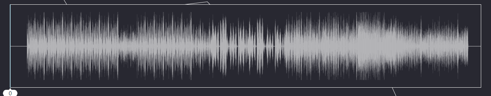
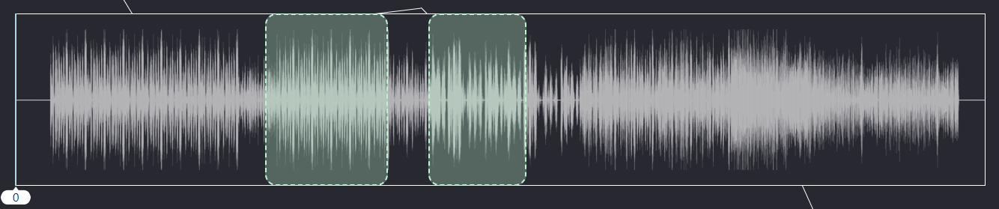
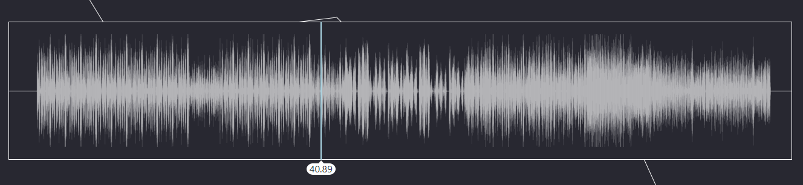
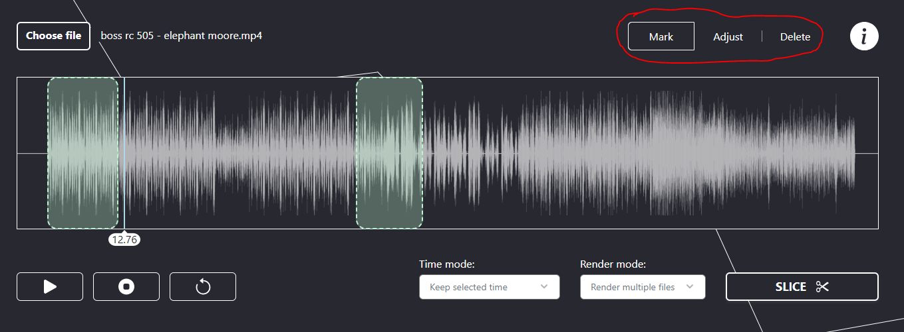
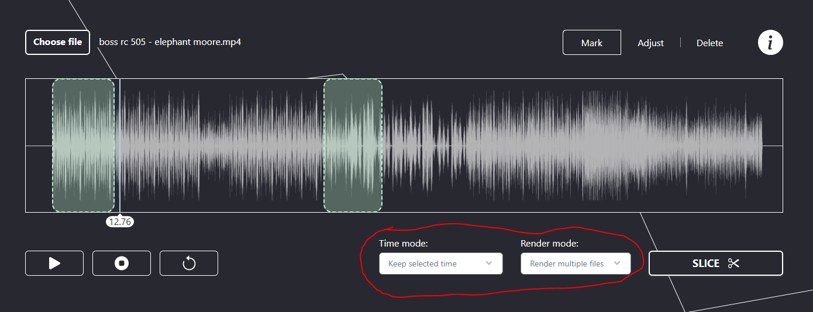
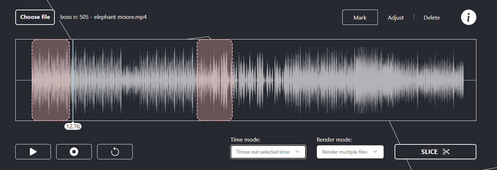
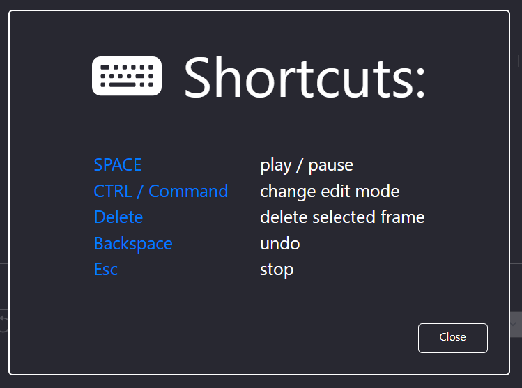

# Audio Slicer

https://audio-slicer.netlify.app/

A web client-side app for slicing audio files.

# Usage

User uploads a file, which browser renders as a waveform.

After this, user is able to use a Marking tool to select the areas of audio they are interested in.

To check which areas to mark, a live playback option and time indicators are provided:

To adjust or remove marked areas, user can change the mode in control panel

User can also alter the rendering mode, to order the app the way in which output audio should be rendered. User can either:

1. Choose to render or erase the selected fragments
2. Choose whether the marked or remaining parts of audio should be rendered to single or multiple files.

A handful of keyboard shortcuts for easier operations were also created:

# Technical notes

Project created with create-react-app and adjusted to needs.

To run project locally use:

`npm run start`

To check the production build run:

`npm run build`

# Limitations

At the time of writing slicing tested on mp3 and mp4 files.

App is designed for desktop devices, small screen may be not supported at the moment.

# Deployment

To deploy simply push changes to master. This will trigger a Netlify build pipeline.

# Local testing

A `test.mp3` local repository file was provided for testing purposes
